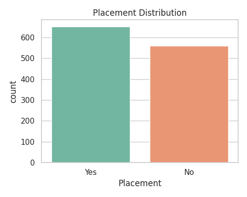
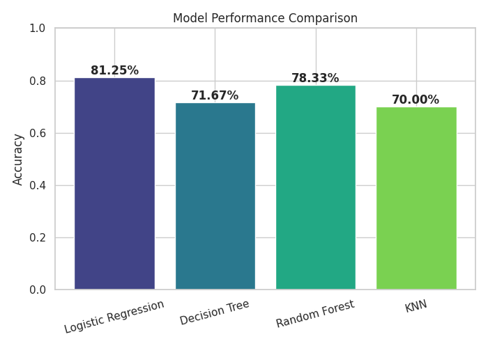
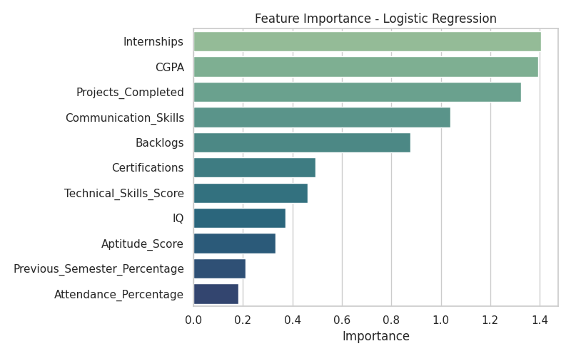

# 🎓 Student Placement Prediction

A complete end-to-end **Machine Learning + Streamlit web app** that predicts whether a student is likely to be placed, based on academic performance and skill-related attributes.


---

## 📖 Overview

**Student Placement Prediction** is a supervised classification project that estimates a student's placement likelihood from CGPA, IQ, aptitude, technical/communication skills, internships, projects, certifications, attendance, and backlogs.

The project covers the **complete ML lifecycle**:

* 🧹 Data cleaning & preprocessing
* 📊 Exploratory Data Analysis (EDA)
* 🤖 Training & comparing 4 classification models
* 🏆 Automatic best-model selection
* 🌐 An interactive Streamlit web app for single & batch predictions

It's designed to be portfolio-ready — clean structure, documented code, and a polished UI.

---

## ✨ Features

| Feature | Description |
|---|---|
| 🔍 Single Prediction | Enter a student's profile in the sidebar and get an instant prediction |
| 📂 Batch Prediction | Upload a CSV of many students and download predictions as CSV |
| 📈 Model Comparison | Visual comparison of Logistic Regression, Decision Tree, Random Forest, KNN |
| 🌟 Feature Importance | See which attributes matter most for placement |
| 🎯 Confidence Score | Every prediction includes a model confidence percentage |
| 💡 Recommendations | Personalized, rule-based tips to improve placement chances |
| 🌓 Dark Mode Ready | UI styling adapts cleanly to Streamlit's light/dark themes |

---

## 🛠️ Technology Stack

- **Python 3.12**
- **Pandas** & **NumPy** — data manipulation
- **Matplotlib** & **Seaborn** — visualization
- **Scikit-learn** — model training & evaluation
- **Joblib** — model persistence
- **Streamlit** — interactive web application

---

## 📁 Project Structure

```
Student-Placement-Prediction/
├── data/
│   └── placement.csv              # Synthetic dataset (1000+ records)
├── notebooks/
│   └── EDA.ipynb                  # Exploratory data analysis
├── models/
│   ├── placement_model.pkl        # Best trained model (generated)
│   ├── scaler.pkl                 # Fitted StandardScaler (generated)
│   └── feature_columns.pkl        # Feature order reference (generated)
├── screenshots/                   # EDA & app screenshots
├── src/
│   ├── __init__.py
│   ├── preprocess.py               # Cleaning, encoding, scaling, split
│   ├── train.py                    # Trains & compares models, saves best
│   ├── predict.py                  # Loads model, single & batch prediction
│   └── utils.py                    # Metrics printing & plotting helpers
├── app.py                          # Streamlit web application
├── requirements.txt
├── README.md
├── LICENSE
└── .gitignore
```

---

## 🗂️ Dataset

A realistic **synthetic dataset of 1,200+ records** (`data/placement.csv`) with the following columns:

| Column | Description |
|---|---|
| `CGPA` | Cumulative GPA (4.0 – 10.0) |
| `IQ` | Intelligence quotient score |
| `Previous_Semester_Percentage` | Marks percentage in the previous semester |
| `Communication_Skills` | Self/assessed rating (1–10) |
| `Aptitude_Score` | Aptitude test score (0–100) |
| `Technical_Skills_Score` | Technical assessment score (0–100) |
| `Projects_Completed` | Number of projects completed |
| `Internships` | Number of internships completed |
| `Certifications` | Number of relevant certifications |
| `Attendance_Percentage` | Overall attendance (%) |
| `Backlogs` | Number of pending backlogs |
| `Placement` | Target — `Yes` / `No` |

> The dataset was generated with realistic correlations (e.g. higher CGPA/internships/communication → higher placement probability) plus injected missing values & duplicates, so the cleaning pipeline in `preprocess.py` has real work to do.

---

## ⚙️ Installation

### 1. Clone the repository

```bash
git clone https://github.com/your-username/Student-Placement-Prediction.git
cd Student-Placement-Prediction
```

### 2. Create a virtual environment

**Windows:**
```bash
python -m venv venv
venv\Scripts\activate
```

**macOS / Linux:**
```bash
python3 -m venv venv
source venv/bin/activate
```

### 3. Install dependencies

```bash
pip install -r requirements.txt
```

---

## 🚀 How to Run

### 1. Train the model

```bash
python src/train.py
```

This will:
- Load & clean `data/placement.csv`
- Train Logistic Regression, Decision Tree, Random Forest, and KNN
- Print accuracy, precision, recall, F1, confusion matrix, and classification report for each
- Save confusion matrices, a model comparison chart, and a feature importance chart to `screenshots/`
- Save the best-performing model (by F1 score) to `models/placement_model.pkl`

### 2. Launch the Streamlit app

```bash
streamlit run app.py
```

Then open the local URL shown in your terminal (typically `http://localhost:8501`).

---

## 📊 Model Training Summary

| Model | Accuracy | Precision | Recall | F1 Score |
|---|---|---|---|---|
| Logistic Regression | ~81% | ~0.82 | ~0.83 | **~0.83** ✅ Best |
| Random Forest | ~78% | ~0.79 | ~0.81 | ~0.80 |
| KNN | ~70% | ~0.71 | ~0.74 | ~0.73 |
| Decision Tree | ~72% | ~0.71 | ~0.81 | ~0.75 |

> Exact values vary slightly with the random seed / data split. Run `src/train.py` to reproduce results on your machine.

---

## 🖼️ Screenshots

> Add your own screenshots to the `screenshots/` folder and reference them below.

| EDA — Placement Distribution | Model Comparison | Feature Importance |
|---|---|---|
|  |  |  |

| Streamlit App — Prediction Tab |
|---|
|  |

> 💡 `app_prediction.png` is a placeholder — run `streamlit run app.py`, take a screenshot of the running app, and save it into `screenshots/` under that name (see [Adding Screenshots](#-adding-screenshots-to-github) below).

---

## 🔮 Sample Prediction

```python
from src.predict import predict_placement

sample_student = {
    "CGPA": 8.2,
    "IQ": 108,
    "Previous_Semester_Percentage": 78.5,
    "Communication_Skills": 7.5,
    "Aptitude_Score": 72.0,
    "Technical_Skills_Score": 80.0,
    "Projects_Completed": 4,
    "Internships": 1,
    "Certifications": 2,
    "Attendance_Percentage": 90.0,
    "Backlogs": 0,
}

result = predict_placement(sample_student)
print(result)
# {'prediction': 'Placed', 'confidence': 94.3, 'recommendation': '...'}
```

**Output in the app:**

```
Prediction: Placed
Confidence: 94%
Recommendation: Excellent academic profile. Continue improving
                communication and interview skills.
```

---

## 🧭 Future Improvements

- [ ] Hyperparameter tuning with `GridSearchCV` / `Optuna`
- [ ] Add XGBoost / LightGBM as candidate models
- [ ] SHAP-based explainability for individual predictions
- [ ] User authentication for saving prediction history
- [ ] Deploy to Streamlit Community Cloud / Docker container
- [ ] REST API (FastAPI) alongside the Streamlit UI

---

## 💼 Resume Highlights

Suggested resume bullet points for this project:

> - Built and deployed a full-stack **ML web application** predicting student placement outcomes with **~81% accuracy**, using Python, Scikit-learn, and Streamlit.
> - Engineered a complete ML pipeline — data cleaning, feature scaling, model training, and evaluation — comparing 4 classification algorithms (Logistic Regression, Decision Tree, Random Forest, KNN).
> - Designed an interactive Streamlit UI supporting single & batch predictions, CSV export, and model-insight visualizations (feature importance, confusion matrices).
> - Followed modular, PEP 8-compliant software engineering practices with reusable preprocessing and utility modules.

---

## ⬆️ Uploading to GitHub

```bash
git init
git add .
git commit -m "Initial commit: Student Placement Prediction project"
git branch -M main
git remote add origin https://github.com/your-username/Student-Placement-Prediction.git
git push -u origin main
```

## 📸 Adding Screenshots to GitHub

1. Run the app locally: `streamlit run app.py`
2. Take screenshots of each tab (Single Prediction, Batch Prediction, Model Insights)
3. Save them into the `screenshots/` folder using the filenames referenced above (e.g. `app_prediction.png`)
4. `git add screenshots/*.png && git commit -m "Add app screenshots" && git push`

---

## 🤝 Contributing

Contributions are welcome!

1. Fork the repository
2. Create a feature branch (`git checkout -b feature/your-feature`)
3. Commit your changes (`git commit -m "Add your feature"`)
4. Push to the branch (`git push origin feature/your-feature`)
5. Open a Pull Request

---

## 📄 License

This project is licensed under the [MIT License](LICENSE).

---

## 📬 Contact

**Your Name**
📧 your.email@example.com
🔗 [LinkedIn](https://linkedin.com/in/your-profile) · [GitHub](https://github.com/your-username)

---

<p align="center">⭐ If you found this project useful, consider giving it a star! ⭐</p>
